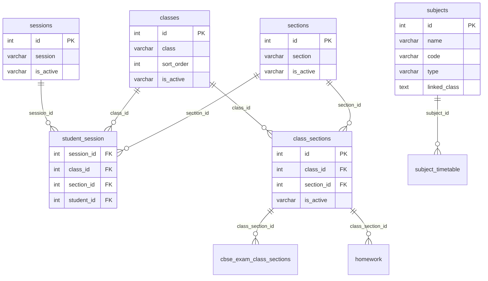

# Academics Domain — Analysis & Relationships

**App:** `apps.academics`  
**Inventory:** `academics_domain_inventory.json`

---

## Entity relationship diagram



---

## Table roles

### `sessions` (14 rows)

Academic years (e.g. `2024-25`). **Not** Django HTTP sessions.

- Referenced by: `student_session`, `cbse_exams`, `exam_groups`, `feemasters`, etc.
- One active session drives current-year operations (`is_active` varchar)

### `classes` (17 rows)

Grade/class levels (e.g. Class 1, Class 12).

- Column `class` holds display name (reserved word → `class_field` in Django)
- `sort_order` for UI ordering

### `sections` (15 rows)

Sections within a class (A, B, C).

### `class_sections` (94 rows)

**Junction table** — valid class + section combinations.

| FK | ON DELETE |
|----|-----------|
| `class_id` → `classes` | CASCADE |
| `section_id` → `sections` | CASCADE |

Used by exams, homework, online admissions, CBSE class-section mapping.

### `subjects` (30 rows)

Subject master list.

- `code`, `type` required
- `linked_class` is **text** (not normalized FK) — legacy serialized class ids

---

## Dependency graph (implementation order)

```
1. sessions      (no deps)
2. classes       (no deps)
3. sections      (no deps)
4. class_sections (deps: classes, sections)
5. subjects      (no deps)
```

---

## Row counts

| Table | Rows |
|-------|------|
| `sessions` | 14 |
| `classes` | 17 |
| `sections` | 15 |
| `class_sections` | 94 |
| `subjects` | 30 |

---

## Files

| File | Purpose |
|------|---------|
| `academics_domain_inventory.json` | Full schema metadata |
| `academics_domain_analysis.md` | Auto FK / referenced-by listing |
| `model_mapping_plan.md` | Table → model map |
| `mismatch_report.md` | Assumption corrections |
