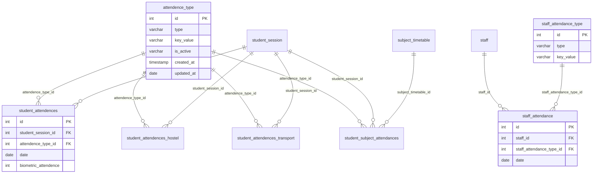

# Attendance Domain — Analysis

**Source:** `db_current` introspection  
**Inventory:** [attendance_domain_inventory.json](./attendance_domain_inventory.json)  
**Tables in `apps.attendance`:** 1

---

## Table inventory

| Table | PK | Rows | Cols | FKs | Depends On |
|-------|-----|------|------|-----|------------|
| `attendence_type` | `id` | 6 | 6 | 0 | — |

### Excluded (other apps)

| Table | App | Rows | FK to `attendence_type` |
|-------|-----|------|-------------------------|
| `student_attendences` | students | 1,028,060 | Yes |
| `student_attendences_hostel` | students | 6 | Yes |
| `student_attendences_transport` | students | 0 | Yes |
| `student_subject_attendances` | students | 0 | Yes |
| `staff_attendance` | staff | 0 | No (`staff_attendance_type`) |
| `staff_attendance_type` | staff | 5 | No |
| `cyc_ptm_attendance` | unclassified | 0 | No |

---

## Ownership mapping

| Table | Owner |
|-------|-------|
| `attendence_type` | **attendance** — shared lookup for all student attendance fact tables |
| `student_attendences*` | **students** — attendance transaction data |
| `staff_attendance*` | **staff** — separate staff attendance subsystem |

---

## ER relationship diagram



**Legend:** Solid relationships to `attendence_type` are DB-enforced FKs from students app tables. Staff attendance uses a parallel type table (`staff_attendance_type`).

---

## Column detail — `attendence_type`

| Column | Type | Null | Default |
|--------|------|------|---------|
| `id` | int(11) | NO | auto_increment |
| `type` | varchar(50) | YES | NULL |
| `key_value` | varchar(50) | NO | — |
| `is_active` | varchar(255) | YES | `'no'` |
| `created_at` | timestamp | NO | CURRENT_TIMESTAMP ON UPDATE |
| `updated_at` | date | YES | NULL |

---

## Dependency graph

```
attendence_type (attendance app)
    └──► student_attendences* (students app — already mapped)
    └──► student_subject_attendances (students app — needs subject_timetable)

staff_attendance_type (staff app)
    └──► staff_attendance (staff app — already mapped)
```

---

## Related documents

| Document | Purpose |
|----------|---------|
| [model_mapping_plan.md](./model_mapping_plan.md) | Table → model mapping |
| [mismatch_report.md](./mismatch_report.md) | Legacy naming and type quirks |
