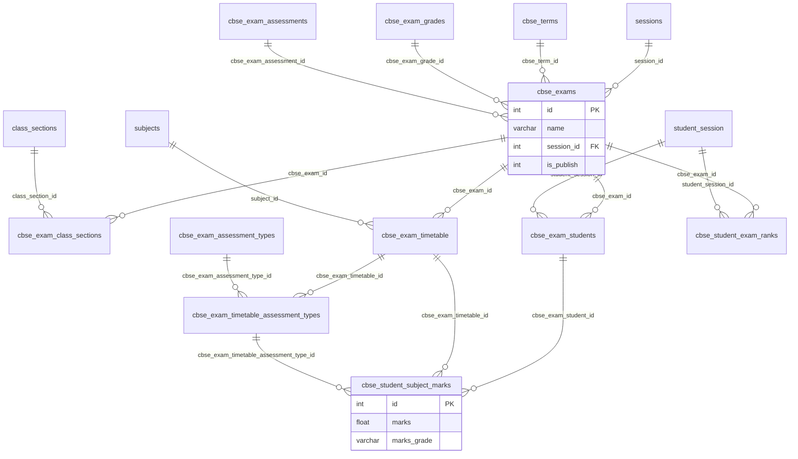

# Examinations Domain — Table Inventory

**Tables in `apps.examinations`:** 41

| Table | PK | Rows | Cols | FKs | Depends On |
|-------|-----|------|------|-----|------------|
| `cbse_exam_assessment_types` | `id` | 15 | 11 | 1 | `cbse_exam_assessments` |
| `cbse_exam_assessments` | `id` | 10 | 3 | 0 | — |
| `cbse_exam_class_sections` | `id` | 676 | 4 | 2 | `cbse_exams`, `class_sections` |
| `cbse_exam_grades` | `id` | 2 | 4 | 0 | — |
| `cbse_exam_grades_range` | `id` | 16 | 8 | 1 | `cbse_exam_grades` |
| `cbse_exam_observations` | `id` | 12 | 4 | 0 | — |
| `cbse_exam_student_subject_rank` | `id` | 0 | 7 | 3 | `cbse_template`, `student_session`, `subjects` |
| `cbse_exam_students` | `id` | 23305 | 10 | 2 | `cbse_exams`, `student_session` |
| `cbse_exam_timetable` | `id` | 654 | 15 | 2 | `cbse_exams`, `subjects` |
| `cbse_exam_timetable_assessment_types` | `id` | 816 | 4 | 2 | `cbse_exam_assessment_types`, `cbse_exam_timetable` |
| `cbse_exam_timetable_grade` | `tg_id` | 4600 | 8 | 0 | — |
| `cbse_exams` | `id` | 108 | 17 | 4 | `cbse_exam_assessments`, `cbse_exam_grades`, `cbse_terms` (+1) |
| `cbse_marksheet_type` | `id` | 4 | 3 | 0 | — |
| `cbse_observation_class_section` | `id` | 0 | 4 | 0 | — |
| `cbse_observation_parameters` | `id` | 4 | 4 | 0 | — |
| `cbse_observation_subparameter` | `id` | 33 | 7 | 2 | `cbse_exam_observations`, `cbse_observation_parameters` |
| `cbse_observation_term_student_subparameter` | `id` | 17809 | 6 | 3 | `cbse_observation_subparameter`, `cbse_observation_terms`, `student_session` |
| `cbse_observation_terms` | `id` | 18 | 5 | 3 | `cbse_exam_observations`, `cbse_terms`, `sessions` |
| `cbse_student_exam_ranks` | `id` | 240 | 6 | 2 | `cbse_exams`, `student_session` |
| `cbse_student_subject_marks` | `id` | 169901 | 10 | 4 | `cbse_exam_assessment_types`, `cbse_exam_students`, `cbse_exam_timetable` (+1) |
| `cbse_student_subject_result` | `id` | 0 | 4 | 0 | — |
| `cbse_student_template_rank` | `id` | 0 | 6 | 2 | `cbse_template`, `student_session` |
| `cbse_template` | `id` | 25 | 36 | 3 | `cbse_exams`, `sessions` |
| `cbse_template_class_sections` | `id` | 142 | 4 | 2 | `cbse_template`, `class_sections` |
| `cbse_template_term_exams` | `id` | 68 | 8 | 3 | `cbse_exams`, `cbse_template`, `cbse_template_terms` |
| `cbse_template_terms` | `id` | 24 | 5 | 2 | `cbse_template`, `cbse_terms` |
| `cbse_terms` | `id` | 13 | 6 | 0 | — |
| `exam_group_class_batch_exam_students` | `id` | 111 | 10 | 3 | `exam_group_class_batch_exams`, `student_session`, `students` |
| `exam_group_class_batch_exam_subjects` | `id` | 2 | 14 | 2 | `exam_group_class_batch_exams`, `subjects` |
| `exam_group_class_batch_exams` | `id` | 2 | 14 | 2 | `exam_groups`, `sessions` |
| `exam_group_exam_connections` | `id` | 0 | 7 | 2 | `exam_group_class_batch_exams`, `exam_groups` |
| `exam_group_exam_results` | `id` | 0 | 10 | 3 | `exam_group_class_batch_exam_students`, `exam_group_class_batch_exam_subjects`, `exam_group_students` |
| `exam_group_students` | `id` | 0 | 7 | 3 | `exam_groups`, `student_session`, `students` |
| `exam_groups` | `id` | 3 | 7 | 0 | — |
| `exam_schedules` | `id` | 0 | 14 | 2 | `exams`, `sessions` |
| `exams` | `id` | 0 | 7 | 1 | `sessions` |
| `onlineexam` | `id` | 0 | 24 | 1 | `sessions` |
| `onlineexam_attempts` | `id` | 0 | 4 | 1 | `onlineexam_students` |
| `onlineexam_questions` | `id` | 0 | 9 | 3 | `onlineexam`, `questions`, `sessions` |
| `onlineexam_student_results` | `id` | 0 | 10 | 2 | `onlineexam_questions`, `onlineexam_students` |
| `onlineexam_students` | `id` | 0 | 8 | 2 | `onlineexam`, `student_session` |

## Subsystems

- **cbse_exam** (12): `cbse_exam_assessment_types`, `cbse_exam_assessments`, `cbse_exam_class_sections`, `cbse_exam_grades`, `cbse_exam_grades_range`, `cbse_exam_observations`, `cbse_exam_student_subject_rank`, `cbse_exam_students`, `cbse_exam_timetable`, `cbse_exam_timetable_assessment_types`, `cbse_exam_timetable_grade`, `cbse_exams`
- **cbse_template** (6): `cbse_marksheet_type`, `cbse_template`, `cbse_template_class_sections`, `cbse_template_term_exams`, `cbse_template_terms`, `cbse_terms`
- **cbse_observation** (6): `cbse_exam_observations`, `cbse_observation_class_section`, `cbse_observation_parameters`, `cbse_observation_subparameter`, `cbse_observation_term_student_subparameter`, `cbse_observation_terms`
- **cbse_marks_ranks** (4): `cbse_student_exam_ranks`, `cbse_student_subject_marks`, `cbse_student_subject_result`, `cbse_student_template_rank`
- **legacy_exam_groups** (7): `exam_group_class_batch_exam_students`, `exam_group_class_batch_exam_subjects`, `exam_group_class_batch_exams`, `exam_group_exam_connections`, `exam_group_exam_results`, `exam_group_students`, `exam_groups`
- **legacy_exams** (2): `exam_schedules`, `exams`
- **online_exam** (5): `onlineexam`, `onlineexam_attempts`, `onlineexam_questions`, `onlineexam_student_results`, `onlineexam_students`

---

## ER relationship diagram (CBSE core)

Full subsystem diagrams and flow narrative: [business_flow.md](./business_flow.md).

## Related documents

| Document | Purpose |
|----------|---------|
| [model_mapping_plan.md](./model_mapping_plan.md) | Table → model mapping |
| [mismatch_report.md](./mismatch_report.md) | Naming and type quirks |
| [business_flow.md](./business_flow.md) | Schema-derived flows |
| [examinations_domain_inventory.json](./examinations_domain_inventory.json) | Machine-readable introspection |
