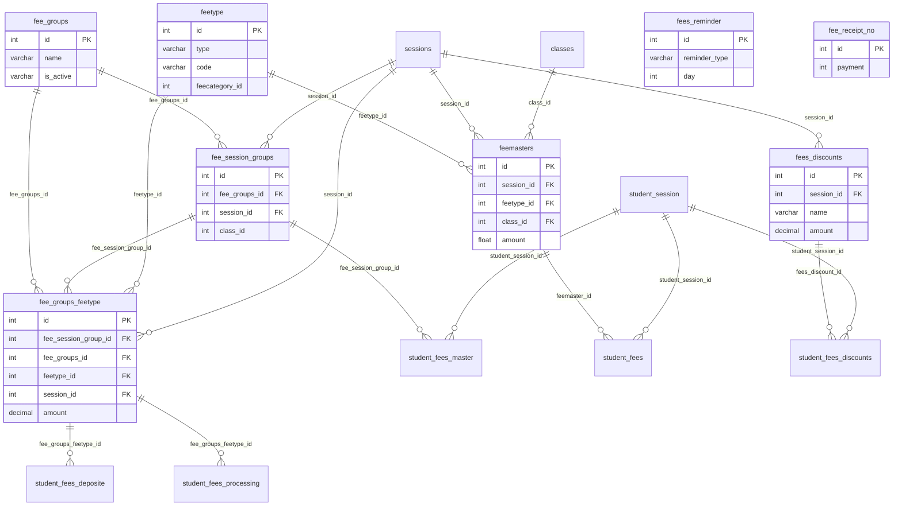

# Fees Domain — Analysis

**Source:** `db_current` introspection  
**Inventory:** [fees_domain_inventory.json](./fees_domain_inventory.json)  
**Tables in `apps.fees`:** 8

---

## Table inventory

| Table | PK | Rows | Cols | FKs | Depends On |
|-------|-----|------|------|-----|------------|
| `fee_groups` | `id` | 11 | 6 | 0 | — |
| `feetype` | `id` | 4 | 9 | 0 | — |
| `fee_session_groups` | `id` | 35 | 6 | 2 | `fee_groups`, `sessions` |
| `fee_groups_feetype` | `id` | 65 | 15 | 4 | `fee_session_groups`, `fee_groups`, `feetype`, `sessions` |
| `feemasters` | `id` | 0 | 9 | 3 | `sessions`, `feetype`, `classes` |
| `fees_discounts` | `id` | 1 | 10 | 1 | `sessions` |
| `fees_reminder` | `id` | 4 | 6 | 0 | — |
| `fee_receipt_no` | `id` | 0 | 2 | 0 | — |

---

## ER relationship diagram



**Legend:** Solid lines = DB-enforced FKs. `class_id` on `fee_session_groups` / `fee_groups_feetype` and student tables are logical links (no DB FK). Student fee tables live in **students** app.

---

## Dependency graph

```
feetype, fee_groups (roots)
    └──► fee_session_groups (+ sessions from academics)
            └──► fee_groups_feetype (+ feetype, fee_groups, sessions)
                    └──► student_fees_deposite / student_fees_processing (students)

feemasters (+ sessions, classes, feetype) ──► student_fees (students)
fees_discounts (+ sessions) ──► student_fees_discounts (students)
fee_session_groups ──► student_fees_master (students)

fees_reminder, fee_receipt_no — standalone configuration
```

---

## Excluded tables

See [model_mapping_plan.md](./model_mapping_plan.md) — `student_fees*`, `offline_fees_payments`, `gateway_*`, accounting tables deferred.

---

## Related documents

| Document | Purpose |
|----------|---------|
| [model_mapping_plan.md](./model_mapping_plan.md) | Table → model mapping |
| [mismatch_report.md](./mismatch_report.md) | Legacy types and naming |
| [cross_app_fk_enhancement_report.md](../cross_app_fk_enhancement_report.md) | Future ForeignKey wiring |
