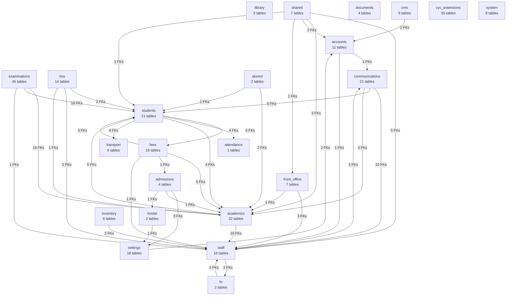

# Final ER Landscape

**Generated:** 2026-06-25 14:28 UTC
**Scope:** Domain-level entity landscape (280 tables across 23 domains)

## Domain map

## Hub domains

| Domain | Outbound FKs | Inbound FKs | Role |
|--------|-------------|-------------|------|
| accounts | 3 | 5 | Module |
| students | 21 | 28 | Reference hub |
| academics | 15 | 40 | Reference hub |
| staff | 4 | 38 | Reference hub |
| attendance | 0 | 4 | Module |
| fees | 10 | 6 | Module |
| examinations | 29 | 0 | Module |
| library | 0 | 0 | Module |
| transport | 1 | 4 | Module |
| hostel | 1 | 2 | Module |
| admissions | 5 | 1 | Module |
| lms | 5 | 1 | Module |
| settings | 2 | 4 | Module |
| communications | 18 | 3 | Module |
| cms | 1 | 0 | Module |
| inventory | 2 | 0 | Module |
| front_office | 5 | 1 | Module |
| documents | 0 | 1 | Module |
| shared | 13 | 0 | Module |
| alumni | 3 | 0 | Module |
| hr | 2 | 2 | Module |
| cyc_extensions | 0 | 0 | Module |
| system | 0 | 0 | Module |

## Domain clusters

- **Identity & access:** accounts, settings (partial)
- **Academic core:** academics, students, staff, attendance
- **Financial:** fees, students (student_fees*), cyc_extensions (ledgers)
- **Assessment:** examinations, lms (quizzes)
- **Operations:** transport, hostel, library, inventory, front_office
- **Engagement:** communications, cms, alumni, admissions
- **Extensions:** cyc_extensions (35 custom tables)
- **Platform:** system, shared, documents