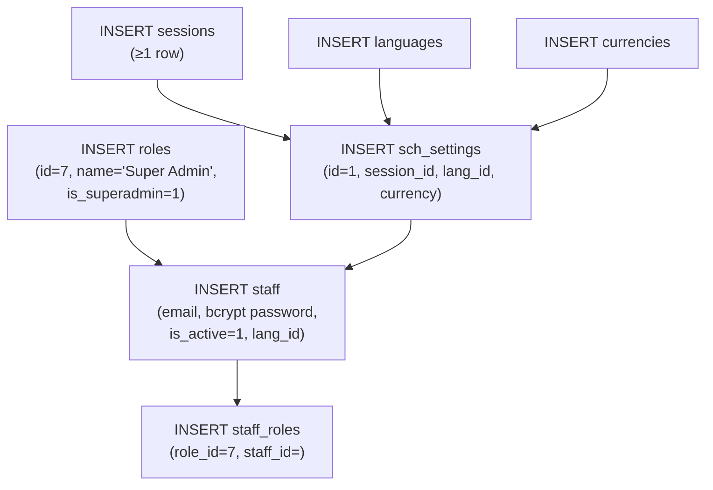
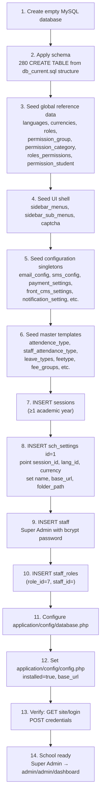

# Minimal Seed Dataset Specification

**Legacy ERP provisioning analysis** — derived from `application/`, `db_current.sql`, and runtime dependencies only.  
**Not a redesign.** This document defines the smallest dataset that satisfies the legacy CodeIgniter ERP’s boot, login, and Super Admin dashboard requirements.

---

## Evidence sources

| Source | What it proves |
|--------|----------------|
| `db_current.sql` | 280 tables, phpMyAdmin dump of database `erp228` (~130 MB, Jun 2026) |
| `application/controllers/Site.php` | Login reads `sch_settings`, `staff`, `captcha` |
| `application/libraries/Rbac.php` | Super Admin (`roles.id = 7`) bypasses all permission checks |
| `application/libraries/Module_lib.php` | Modules = rows in `permission_group` |
| `application/views/layout/sidebar.php` | Admin menu reads `sidebar_menus` + `sidebar_sub_menus` |
| `application/controllers/Site.php` / `MY_Controller.php` | Install guard → `install/start` (controller **not in repo**) |

**Important:** `db_current.sql` is a **production dump** (APPA PUBLIC SCHOOL), not a clean-install script. Row counts below distinguish **absolute minimum** vs **legacy product template** (reconstructed from seed-sized tables in the dump).

---

## SECTION 1 — Mandatory Seed Tables

Tables that **must** contain data before the first Super Admin can log in and reach the admin dashboard without fatal query errors.

| Table | Purpose | Required rows (min) | Mandatory / Optional | Dependency reason |
|-------|---------|---------------------|----------------------|-------------------|
| `sch_settings` | School identity & global config | **1** (`id = 1`) | **Mandatory** | `Setting_model::get()`, `getSetting()`, login page, all admin pages |
| `sessions` | Academic years | **≥ 1** | **Mandatory** | `sch_settings.session_id` → `Setting_model` JOIN on login |
| `languages` | UI language catalog | **≥ 1** | **Mandatory** | `sch_settings.lang_id` JOIN; `MY_Controller` loads language files |
| `currencies` | Currency catalog | **≥ 1** | **Mandatory** | `sch_settings.currency` JOIN; fee/display formatting |
| `roles` | RBAC role definitions | **≥ 1** (must include id **7**) | **Mandatory** | `staff_roles.role_id` FK; login stores role in session |
| `staff` | Admin user identity | **1** (Super Admin) | **Mandatory** | `Site::login()` → `Staff_model::checkLogin()` by email |
| `staff_roles` | Staff ↔ role mapping | **1** | **Mandatory** | FK to `roles`; login builds `admin.roles` session |
| `captcha` | Captcha feature flags | **6** (legacy template) | **Mandatory** | `captchalib->is_captcha('login')` queries by name |
| `permission_group` | Module registry (`Module_lib`) | **38** (legacy template) | **Mandatory** for usable admin UI | `Module_model::get()` / `hasModule()`; sidebar JOIN |
| `sidebar_menus` | Admin sidebar top level | **33** (legacy template) | **Mandatory** for navigation | `sidebarmenu_model->getMenuwithSubmenus()` |
| `sidebar_sub_menus` | Admin sidebar items | **208** (legacy template) | **Mandatory** for navigation | Same; empty sidebar if missing |
| `permission_category` | RBAC permission definitions | **301** (legacy template) | **Optional for Super Admin login**; **Mandatory for other roles** | `Rolepermission_model`; sidebar permission strings reference short_codes |
| `roles_permissions` | Role ↔ permission matrix | **935** (legacy template) | **Optional for Super Admin login**; **Mandatory before creating non–Super Admin staff** | `Rbac::hasPrivilege()` for non–Super Admin |
| `permission_student` | Student/parent panel permissions | **25** (legacy template) | **Optional for admin login** | Required when student/parent panels enabled |

### Tier summary

| Tier | Tables | Blocks first login? |
|------|--------|---------------------|
| **Tier 1 — Login** | `sch_settings`, `sessions`, `languages`, `currencies`, `roles`, `staff`, `staff_roles`, `captcha` | Yes |
| **Tier 2 — Admin shell** | `permission_group`, `sidebar_menus`, `sidebar_sub_menus` | Dashboard loads but menu broken without these |
| **Tier 3 — RBAC for non–Super Admin** | `permission_category`, `roles_permissions`, `permission_student` | No for Super Admin (`Rbac.php` line 27–28 bypass) |

**Legacy template row count (Tier 1 + Tier 2 + Tier 3):** ~1,565 rows.

---

## SECTION 2 — Configuration Tables

Tables that must contain **exactly one default row** (or a fixed small set) per school. Code expects a singleton school record at `sch_settings.id = 1`.

| Table | Required rows | Why required | Per-school customized values |
|-------|---------------|--------------|-------------------------------|
| `sch_settings` | **1** | Entire ERP scopes to this row | `name`, `email`, `phone`, `address`, `base_url`, `folder_path`, `session_id`, `lang_id`, `currency`, `timezone`, `date_format`, `theme`, logos (`image`, `admin_logo`, `admin_small_logo`), admission/staff ID prefixes |
| `front_cms_settings` | **1** | Public website bootstrap | `theme`, contact emails, social URLs, CMS flags |
| `email_config` | **1** | Mailer configuration | SMTP host, port, credentials, `email_type` |
| `sms_config` | **1–2** | SMS gateway | API keys, provider settings |
| `payment_settings` | **1** | Online payment gateway | Gateway type, API keys |
| `behaviour_settings` | **1** | Behaviour module defaults | `comment_option` |
| `qr_code_settings` | **1** | QR/barcode generation | Scan settings |
| `filetypes` | **1** | Upload allow-list | Allowed MIME types |
| `visitors_purpose` | **1** | Front office | Default visit purposes |

### Configuration tables with multiple fixed rows (not singleton, but seeded once)

| Table | Legacy row count | Why required | Customized per school |
|-------|------------------|--------------|----------------------|
| `captcha` | 6 | One row per form (`login`, `userlogin`, `admission`, etc.) | Enable/disable per form (`status`) |
| `notification_setting` | 33 | Email/SMS templates for system events | Template text, active flags |
| `print_headerfooter` | 4 | Print layouts (`student_receipt`, `staff_payslip`, etc.) | Header images, footer HTML |
| `student_edit_fields` | 16 | Which student fields appear in forms | Field visibility flags |
| `payment_settings` | 1 | Payment gateway | Gateway credentials |

---

## SECTION 3 — Master Data

Reference tables seeded from **product templates**. Distinction: **global** (same for every school) vs **school-specific** (empty or generic at install, customized later).

| Table | Legacy template rows | Global / School-specific | Changes after install? |
|-------|---------------------|------------------------|------------------------|
| `languages` | 77 | **Global** catalog | Rarely; school picks via `sch_settings.lang_id` |
| `currencies` | 179 | **Global** catalog | Rarely; school picks via `sch_settings.currency` |
| `roles` | 11 | **Global** product roles | Super Admin adds custom roles via admin UI |
| `permission_group` | 38 | **Global** module definitions | Admin enables/disables modules |
| `permission_category` | 301 | **Global** permission defs | Product upgrades add rows |
| `roles_permissions` | 935 | **Global** default matrix | Admin edits via Roles UI |
| `permission_student` | 25 | **Global** | Admin edits |
| `sidebar_menus` | 33 | **Global** layout | Admin reorders via System Settings |
| `sidebar_sub_menus` | 208 | **Global** layout | Admin reorders |
| `attendence_type` | 6 | **Global** (Present, Absent, Late, etc.) | Admin can add types |
| `staff_attendance_type` | 5 | **Global** | Admin can add |
| `leave_types` | 3 | **Global** template | Admin adds leave types |
| `categories` | 4 | **School-specific** in practice | Admin manages student categories |
| `feetype` | 4 | Mixed (`is_system` flag) | Admin adds fee types |
| `fee_groups` | 11 | Mixed (`is_system` flag) | Admin creates fee structures |
| `fees_reminder` | 4 | **Global** template | Admin configures |
| `disable_reason` | 3 | **Global** template | Admin adds reasons |
| `reference` | 6 | **Global** template | Admin adds |
| `source` | 6 | **Global** template (enquiry sources) | Admin adds |
| `mark_divisions` | 3 | **Global** template | Admin adds |
| `content_types` | 3 | **Global** | Rarely changes |
| `department` | 21 | **School-specific** in dump | Admin creates departments (HR module) |
| `staff_designation` | 19 | **School-specific** in dump | Admin creates designations |
| `school_houses` | 4 | **School-specific** | Admin creates houses |
| `expense_head` | 3 | **School-specific** | Admin creates |
| `income_head` | 4 | **School-specific** | Admin creates |
| `item_category` | 3 | **School-specific** | Inventory setup |
| `item_store` | 2 | **School-specific** | Inventory setup |
| `hostel` | 2 | **School-specific** | Hostel setup |
| `hostel_rooms` | 5 | **School-specific** | Hostel setup |
| `room_types` | 2 | **School-specific** | Hostel setup |
| `custom_fields` | 9 | **School-specific** | Admin defines custom fields |
| `sms_template` | 31 | **Global** templates | Admin edits message text |
| `sessions` | 14 in dump | **School-specific** | Admin adds academic years; min 1 at install |

**Note:** `department`, `staff_designation`, and `school_houses` in `db_current.sql` contain **APPA PUBLIC SCHOOL** data. A clean provision should seed **generic product defaults** or leave empty — staff creation allows `NULL` department (`Staff.php`).

---

## SECTION 4 — Empty Tables

### 4A. Tables empty even in production dump (122 tables)

These have **CREATE TABLE** but **no INSERT** in `db_current.sql`. They should remain empty until the related feature is used.

```
alumni_students, aws_s3_settings, book_issues, books,
cbse_exam_student_subject_rank, cbse_observation_class_section,
cbse_student_subject_result, cbse_student_template_rank,
chat_connections, chat_messages, chat_users, class_section_times,
complaint, complaint_type, conference_sections, conference_staff,
conferences, conferences_history, content_for, contents,
course_lesson_quiz_order, course_progress, course_quiz_answer,
course_quiz_question, course_rating, cy_ptm_time_slot, cy_vehicle_ticket,
cyc_biometric_events, cyc_classes_grouping, cyc_fee_head_ledger,
cyc_fuel_refill, cyc_holiday, cyc_logs, cyc_ptm, cyc_ptm_attendance,
cyc_ptm_schedule, cyc_tags, cyc_vehicle_parts_info, cyc_vehicle_rto_info,
cyc_vehicle_services, email_attachments, email_template,
email_template_attachment, enquiry_type, exam_group_exam_connections,
exam_group_exam_results, exam_group_students, exam_schedules, exams,
expenses, fee_receipt_no, feemasters, follow_up, front_cms_media_gallery,
front_cms_menu_items, front_cms_page_contents, front_cms_program_photos,
front_cms_programs, gateway_ins, gateway_ins_response, general_calls,
geofence_events, geofences, gmeet, gmeet_history, gmeet_sections,
gmeet_settings, gmeet_staff, grades, guest, homework_evaluation, id_card,
income, item, item_issue, item_stock, item_supplier, lesson_plan_forum,
libarary_members, migrations, multi_branch, online_admission_custom_field_value,
online_admission_fields, online_admission_payment, online_admissions,
online_course_lesson, online_course_payment, online_course_processing_payment,
online_course_quiz, online_course_section, online_course_settings, onlineexam,
onlineexam_attempts, onlineexam_questions, onlineexam_student_results,
onlineexam_students, payslip_allowance, positions, questions,
route_pickup_point, share_content_for, share_contents, share_upload_contents,
staff_attendance, staff_payroll, staff_payslip, staff_timeline,
student_attendences_transport, student_doc, student_fees,
student_fees_processing, student_incident_comments, student_quiz_status,
student_subject_attendances, student_transport_fees, subject_groups1,
submit_assignment, transport_feemaster, video_tutorial,
video_tutorial_class_sections, visitors_book, zoom_settings
```

### 4B. Tables that must be empty on a brand-new school (operational data)

These have data in `db_current.sql` because it is a **live school**, but a **fresh provision must not seed them**:

| Domain | Tables |
|--------|--------|
| **People** | `students`, `student_session`, `users`, `users_authentication`, `staff` (beyond Super Admin), `staff_roles` (beyond first row), `staff_leave_details`, `staff_leave_request`, `staff_rating`, `face_authentication` |
| **Academics** | `classes`, `sections`, `class_sections`, `class_teacher`, `subjects`, `subject_groups`, `subject_group_subjects`, `subject_group_class_sections`, `subject_timetable`, `subject_syllabus`, `lesson`, `topic`, `homework`, `daily_assignment` |
| **Attendance** | `student_attendences`, `student_attendences_hostel` |
| **Fees** | `fee_groups_feetype`, `fee_session_groups`, `student_fees_master`, `student_fees_deposite`, `student_fees_discounts`, `fees_discounts`, `offline_fees_payments` |
| **Exams** | All `cbse_*` operational tables, `exam_groups`, `exam_group_class_batch_exams`, `exam_group_class_batch_exam_students`, `exam_group_class_batch_exam_subjects` |
| **Library** | `books`, `book_issues`, `libarary_members` |
| **Transport** | `vehicles`, `vehicle_routes`, `transport_route`, `pickup_point` |
| **Accounting** | `cyc_entries`, `cyc_entryitems`, `cyc_ledgers`, `expenses`, `income` |
| **CRM/Leads** | `cyc_leads`, `cyc_leads_followup`, `enquiry` |
| **Communications** | `messages`, `send_notification`, `notification_roles`, `read_notification` |
| **Logs** | `logs`, `userlog` |
| **Custom field values** | `custom_field_values` |
| **Misc operational** | `events`, `certificates`, `dispatch_receive`, `upload_contents`, `student_timeline`, `student_applyleave`, `student_behaviour`, `student_incidents`, `alumni_events` |

**Total:** 280 tables − ~40 seed/config tables ≈ **240 tables expected empty** at provision time.

---

## SECTION 5 — First Super Admin

### Minimum insert chain



### Exact records required

#### 1. `roles` — at minimum id **7**

From `db_current.sql`:

```sql
(7, 'Super Admin', NULL, 0, 1, 1, '2018-07-11 14:11:29', '0000-00-00')
--                              ^is_system  ^is_superadmin=1
```

Legacy product seeds **11 roles** (ids 1, 2, 3, 4, 6, 7, 8, 9, 11, 12, 13). Only id **7** is required for the first login.

#### 2. `staff` — one row

From `db_current.sql` (vendor default install account):

```sql
INSERT INTO staff (
  id, employee_id, lang_id, currency_id, name, email, password,
  is_active, ...
) VALUES (
  1, '9000', 4, 68, 'Super Admin', 'admin@scholerly.com',
  '$2y$10$...',  -- bcrypt via enc_lib->passHashEnc()
  1, ...
);
```

Login path: `Site::login()` → `Staff_model::checkLogin()` → `enc_lib->passHashDyc()`.

#### 3. `staff_roles` — one row

```sql
INSERT INTO staff_roles (id, role_id, staff_id, is_active, created_at)
VALUES (1, 7, 1, 0, NOW());
```

DB constraint: `FK_staff_roles_roles` FOREIGN KEY (`role_id`) REFERENCES `roles` (`id`).

Session after login stores:

```php
'roles' => array('Super Admin' => 7)  // from Staff_model::checkLogin()
```

### Values that must be generated dynamically at provision time

| Field | Table | Generation rule |
|-------|-------|-------------------|
| `password` | `staff` | Bcrypt hash via `enc_lib->passHashEnc($plaintext)` — legacy uses `$2y$10$...` |
| `email` | `staff` | Provided by provisioner / school admin |
| `name` | `sch_settings` | School name from onboarding form |
| `base_url` | `sch_settings` | Deployment URL |
| `folder_path` | `sch_settings` | Server filesystem path to uploads |
| `session_id` | `sch_settings` | Points to newly inserted `sessions.id` |
| `employee_id` | `staff` | Can be literal `'9000'` in template or auto-generated |
| `cron_secret_key` | `sch_settings` | Random string (can be empty initially) |
| Database name | `database.php` | Created externally before import |

### Values that come from templates (not generated)

| Field | Source |
|-------|--------|
| `roles` rows 1–13 | Product seed template |
| `roles_permissions` matrix | Product seed template |
| `permission_category` / `permission_group` | Product seed template |
| `sidebar_menus` / `sidebar_sub_menus` | Product seed template |
| `languages` / `currencies` catalogs | Product seed template |

---

## SECTION 6 — Provisioning Order

Exact sequence matching legacy behavior (SQL import + config flags):



### FK-safe insert order (database level)

| Step | Tables |
|------|--------|
| 1 | `languages`, `currencies` (no FK deps) |
| 2 | `roles` |
| 3 | `permission_group` → `permission_category` → `roles_permissions` |
| 4 | `permission_student` |
| 5 | `sidebar_menus` → `sidebar_sub_menus` |
| 6 | `sessions` |
| 7 | `sch_settings` (refs sessions, languages, currencies) |
| 8 | `staff` (refs languages) |
| 9 | `staff_roles` (refs staff, roles) |
| 10 | Config singletons (no FK deps on staff) |

---

## SECTION 7 — Seed Package

### Package structure

Replace the monolithic 130 MB dump with three layers:

| Package | Contents | Legacy row count | Purpose |
|---------|----------|------------------|---------|
| **Schema** | 280 `CREATE TABLE` + indexes + FK constraints | 0 data rows | Database structure |
| **Core Seed** | Tier 1 login + Tier 2 admin shell | ~296 rows | First login + navigation |
| **Reference Seed** | RBAC matrix + catalogs + config + masters | ~1,700 rows | Full product behavior |
| **Optional Seed** | CMS pages, SMS templates, fee templates, sample departments | varies | Accelerate setup |

### Core Seed tables (~296 rows)

```
sch_settings          1
sessions              1 (min) / 14 (legacy template)
languages             1 (min) / 77 (template)
currencies            1 (min) / 179 (template)
roles                11
staff                 1
staff_roles           1
captcha               6
permission_group     38
sidebar_menus        33
sidebar_sub_menus   208
```

### Reference Seed tables (~1,700 rows)

```
permission_category   301
roles_permissions     935
permission_student     25
attendence_type         6
staff_attendance_type   5
leave_types             3
notification_setting   33
student_edit_fields    16
print_headerfooter      4
captcha                 6  (included in core)
feetype                 4
fee_groups             11
fees_reminder           4
categories              4
disable_reason          3
reference               6
source                  6
mark_divisions          3
content_types           3
filetypes               1
behaviour_settings      1
qr_code_settings        1
front_cms_settings      1
email_config            1
sms_config              2
payment_settings        1
sms_template           31
visitors_purpose        1
```

### Optional Seed (school may customize or skip)

```
front_cms_menus, front_cms_pages    CMS starter content
department, staff_designation       Generic HR templates (or empty)
school_houses                       Empty or template
expense_head, income_head           Empty
hostel, hostel_rooms, room_types    Empty unless hostel module used
item_category, item_store           Empty unless inventory used
custom_fields                       Empty
certificates, template_*            Empty
```

### Size estimate

| Artifact | Size (estimate) | Basis |
|----------|-----------------|-------|
| `db_current.sql` (production) | **~130 MB** | Measured: 130,504,967 bytes |
| Schema only (280 tables) | **~2–4 MB** | CREATE TABLE + indexes, no bulk data |
| Core + Reference seed data | **~1–3 MB** | ~2,000 rows vs 1,459,761 rows in dump |
| **Minimal seed package total** | **~3–7 MB** | Schema + seed SQL files |
| Operational data excluded | **~123 MB** | `student_attendences` (1,028,060 rows), `cbse_student_subject_marks` (169,901), `logs` (132,892), etc. |

```
130 MB production dump
        │
        ├── ~123 MB operational/transactional data  → NEVER seed
        ├── ~2–4 MB schema                          → ALWAYS apply
        └── ~1–3 MB reference + config seed         → Minimal Seed Package
```

---

## SECTION 8 — Things That Must NEVER Be Seeded

Business and transactional tables must start **empty** and receive data only through ERP operations.

| Category | Tables | Why never seed |
|----------|--------|----------------|
| **Students** | `students`, `student_session`, `users`, `users_authentication` | Pupil records belong to the school; seeding breaks admission numbering |
| **Staff (operational)** | `staff` beyond Super Admin, `staff_roles` beyond first row, `staff_leave_*`, `staff_rating`, `staff_attendance`, `staff_payroll`, `staff_payslip` | HR data is school-specific |
| **Attendance** | `student_attendences`, `student_attendences_hostel`, `student_attendences_transport`, `student_subject_attendances` | Daily transactional records |
| **Fees** | `student_fees_master`, `student_fees_deposite`, `student_fees`, `student_fees_processing`, `offline_fees_payments`, `fee_session_groups` (per-school), `fee_groups_feetype` (per-school) | Financial transactions |
| **Exams** | All `cbse_exam_students`, `cbse_student_subject_marks`, `exam_group_class_batch_exam_students`, etc. | Exam results tied to enrolled students |
| **Classes (operational)** | `classes`, `sections`, `class_sections`, `class_teacher`, `subjects`, `subject_groups`, `subject_timetable` | Academic structure is school-defined |
| **Library** | `books`, `book_issues`, `libarary_members` | Catalog built by school |
| **Transport** | `vehicles`, `vehicle_routes`, `transport_route`, `pickup_point`, `route_pickup_point` | Fleet managed by school |
| **Accounting** | `cyc_entries`, `cyc_entryitems`, `expenses`, `income` | Ledger transactions |
| **Admissions** | `online_admissions`, `online_admission_payment` | Public intake workflow |
| **Communications** | `messages`, `send_notification`, `read_notification` | Runtime notifications |
| **Logs** | `logs`, `userlog` | Audit trail starts at first operation |
| **Custom values** | `custom_field_values` | Values tied to student/staff records |
| **Multi-branch** | `multi_branch` | Branch registry; empty until addon configured |
| **Migrations tracker** | `migrations` | Populated only if CI migrations run |

**Why:** The legacy ERP has **no `school_id` column**. All rows in these tables implicitly belong to the single school in the database. Seeding production data would attach another school's students, fees, and attendance to the new deployment.

---

## Appendix A — Installation files in the legacy codebase

| File | Role |
|------|------|
| `db_current.sql` | Full schema + data (production snapshot) |
| `application/controllers/Site.php` | `check_installation()` |
| `application/core/MY_Controller.php` | `check_installation()` |
| `application/config/config.php` | `$config['installed']`, `$config['base_url']` |
| `application/config/database.php` | DB connection |
| `application/config/migration.php` | Migration config (disabled) |
| `application/controllers/Migrate.php` | Manual `/migrate` endpoint |
| `application/config/license.php` | License keys (file-level, not DB) |
| `index.php` | Front controller |
| `application/controllers/install/` | **Missing** — referenced install wizard |

## Appendix B — Reinstall support

| Question | Evidence |
|----------|----------|
| Can existing school be reinstalled? | **No dedicated flow.** Setting `installed=false` redirects to missing `install/start`. |
| Can DB be re-imported? | **Manual only** — re-import `db_current.sql` or run missing wizard externally. |
| Does `/migrate` reset data? | **No** — `Migrate.php` runs schema migrations only; `migrations` table is empty; no migration PHP files in repo. |

## Appendix C — Pre-login configuration checklist

| Layer | Required |
|-------|----------|
| MySQL database exists | Yes |
| `application/config/database.php` points to DB | Yes |
| 280 tables created | Yes |
| Tier 1 seed rows present | Yes |
| `$config['installed'] = true` in `config.php` | Yes |
| `$config['base_url']` matches deployment URL | Yes |
| `application/controllers/install/` absent | Yes (or app dies with error) |
| Super Admin `staff.email` + bcrypt `password` | Yes |
| `sch_settings.id = 1` with valid FK refs | Yes |

---

*Generated from legacy ERP analysis. Row counts parsed from `db_current.sql` (Jun 2026). No architectural changes proposed.*
