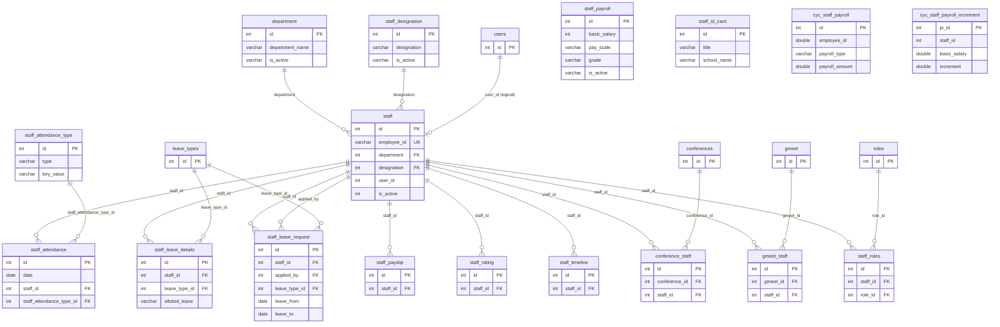

# Staff Domain — Analysis

**Source:** `db_current` introspection  
**Inventory:** [staff_domain_inventory.json](./staff_domain_inventory.json)  
**Tables:** 16 mapped in `apps.staff` (+ `staff_roles` in `apps.accounts`)

---

## Table inventory

| Table | PK | Rows | Cols | FKs | Depends On |
|-------|-----|------|------|-----|------------|
| `department` | `id` | 21 | 3 | 0 | — |
| `staff_designation` | `id` | 19 | 3 | 0 | — |
| `staff` | `id` | 289 | 54 | 2 | `department`, `staff_designation` |
| `staff_attendance_type` | `id` | 5 | 6 | 0 | — |
| `staff_attendance` | `id` | 0 | 10 | 2 | `staff`, `staff_attendance_type` |
| `staff_leave_details` | `id` | 690 | 4 | 2 | `leave_types`, `staff` |
| `staff_leave_request` | `id` | 2 | 13 | 3 | `leave_types`, `staff` |
| `staff_payroll` | `id` | 0 | 5 | 0 | — |
| `staff_payslip` | `id` | 0 | 20 | 1 | `staff` |
| `staff_rating` | `id` | 78 | 8 | 1 | `staff` |
| `staff_timeline` | `id` | 0 | 9 | 1 | `staff` |
| `staff_id_card` | `id` | 2 | 22 | 0 | — |
| `conference_staff` | `id` | 0 | 4 | 2 | `conferences`, `staff` |
| `gmeet_staff` | `id` | 0 | 4 | 2 | `gmeet`, `staff` |
| `cyc_staff_payroll` | `id` | 4 | 5 | 0 | — |
| `cyc_staff_payroll_increment` | `pi_id` | 3 | 11 | 0 | — |

### Excluded

| Table | App | Rows | Notes |
|-------|-----|------|-------|
| `staff_roles` | accounts | — | `staff_id` + `role_id` RBAC junction |

---

## Ownership mapping

| Table | Owner |
|-------|-------|
| `department`, `staff_designation`, `staff` | staff core |
| `staff_attendance*`, `staff_leave_*`, `staff_payslip`, `staff_rating`, `staff_timeline` | staff HR |
| `staff_payroll`, `staff_id_card` | staff config (no FK to `staff`) |
| `conference_staff`, `gmeet_staff` | staff app (communications bridge tables) |
| `cyc_staff_payroll*` | staff app (cyc extension; future `cyc_extensions` candidate) |
| `staff_roles` | **accounts** (auth/RBAC) |

---

## Foreign keys (DB-enforced)

### `staff`
- `designation` → `staff_designation.id` (`staff_ibfk_1`, CASCADE)
- `department` → `department.id` (`staff_ibfk_2`, CASCADE)

### `staff_attendance`
- `staff_id` → `staff.id`
- `staff_attendance_type_id` → `staff_attendance_type.id`

### `staff_leave_details`
- `leave_type_id` → `leave_types.id`
- `staff_id` → `staff.id`

### `staff_leave_request`
- `staff_id` → `staff.id`
- `applied_by` → `staff.id` (self-reference)
- `leave_type_id` → `leave_types.id`

### `staff_payslip`, `staff_rating`, `staff_timeline`
- `staff_id` → `staff.id`

### `conference_staff`
- `conference_id` → `conferences.id`
- `staff_id` → `staff.id`

### `gmeet_staff`
- `gmeet_id` → `gmeet.id`
- `staff_id` → `staff.id`

### Logical (no DB FK)
- `staff.user_id` → `users.id` (accounts)
- `staff_roles.staff_id` → `staff.id` (accounts app)
- `cyc_staff_payroll.employee_id` → loose link to staff employee codes

---

## ER relationship diagram



**Legend:** Solid FK lines = DB-enforced constraints. `users` ↔ `staff` and `cyc_staff_payroll.employee_id` are logical links only.

---

## Dependency graph (implementation)

```
accounts (users, roles, staff_roles)
    └──► staff (department, staff_designation, staff)
            ├──► staff_attendance (+ staff_attendance_type)
            ├──► staff_leave_* (needs leave_types from settings)
            ├──► staff_payslip / staff_rating / staff_timeline
            └──► conference_staff / gmeet_staff (needs communications tables)

staff_payroll, staff_id_card, cyc_staff_payroll* — independent config tables
```

---

## Cross-domain consumers of `staff`

Tables outside the staff app that reference `staff.id` (sample):

`class_teacher`, `homework`, `daily_assignment`, `contents`, `chat_users`, `item_issue`, `enquiry`, `follow_up`, `online_course_*`, `staff_roles`

Full list: see [domain_dependency_report.md](../domain_dependency_report.md).

---

## Related documents

| Document | Purpose |
|----------|---------|
| [model_mapping_plan.md](./model_mapping_plan.md) | Table → model → app mapping |
| [mismatch_report.md](./mismatch_report.md) | Legacy types, naming, constraints |
| [staff_domain_inventory.json](./staff_domain_inventory.json) | Machine-readable introspection |
