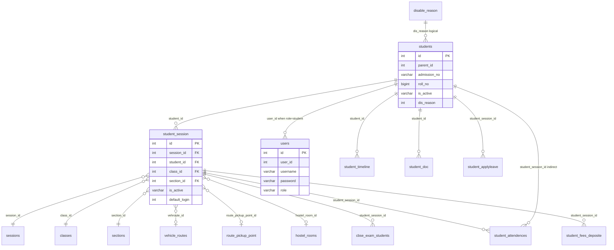

# Students Domain — Analysis & Relationships

## Entity relationship diagram



---

## Core relationships

### 1. Student identity (`students`)

- **PK:** `id` (int)
- **Parent link:** `parent_id` (int, no FK) — pairs with `users` where `role=parent`
- **Lifecycle:** `is_active` varchar, `dis_reason` + `disable_at` for inactive students
- **3,605 rows**

### 2. Session enrollment (`student_session`)

Central junction table — **one student, many academic sessions**:

| FK column | References | ON DELETE |
|-----------|------------|-----------|
| `session_id` | `sessions` | CASCADE |
| `student_id` | `students` | CASCADE |
| `class_id` | `classes` | CASCADE |
| `section_id` | `sections` | CASCADE |
| `vehroute_id` | `vehicle_routes` | SET NULL |
| `route_pickup_point_id` | `route_pickup_point` | SET NULL |
| `hostel_room_id` | `hostel_rooms` | SET NULL |

- **8,648 rows** (~2.4 sessions per student average)
- `default_login` — marks which session is used for student portal login
- `is_alumni` — promotion tracking

### 3. Authentication bridge (`users`)

```
students.id ← users.user_id  (when users.role = 'student')
student_session.default_login → active enrollment for portal
```

### 4. Satellite tables (same domain)

| Table | Links via | Rows |
|-------|-----------|------|
| `student_attendences` | `student_session_id` | 1,028,060 |
| `student_fees_deposite` | `student_session_id` | 2,244 |
| `student_timeline` | `student_id` | — |
| `student_doc` | `student_id` | 0 |
| `student_applyleave` | `student_session_id` | 32 |
| `student_behaviour` | `student_id` | 1 |

---

## Dependency order for model implementation

```
1. disable_reason          (no deps)
2. students                (no FK deps)
3. student_session         (deps: students + cross-app integers)
4. student_timeline, student_doc, student_behaviour
5. student_attendences*    (deps: student_session, attendence_type)
6. student_fees*           (deps: student_session, fees tables)
7. student_incidents*      (deps: students)
```

---

## Approved domain reclassifications (inventory)

| Pattern | Domain |
|---------|--------|
| `cbse_*` | examinations |
| `staff_roles` | accounts |
| `online_course_*` | lms |
| `online_admissions_*` | admissions |
| `cyc_*` | pending — see `cyc_domain_proposal.md` |

---

## Files

| File | Purpose |
|------|---------|
| `students_domain_inventory.json` | Full column + FK metadata |
| `students_domain_analysis.md` | Auto-generated FK listing |
| `model_mapping_plan.md` | Table → model file map |
| `mismatch_report.md` | Assumption corrections |
